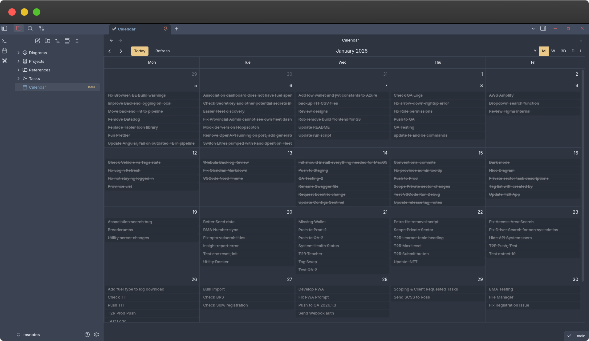

# Obsidian Vault

This repository is my personal Obsidian vault configuration: notes, layout, templates, plugins, and themes. It documents how I organise notes, the key community plugins I rely on, and the folder structure I use across devices.

---

### 📚 What you'll find here

- Vault content and top-level folders used for organisation (notes, projects, references, diagrams, tasks).
- A curated list of community plugins and recommended settings.
- Notes about theme(s), CSS snippets and preferred pane layout / workflows.

---

### 📁 Vault Structure (top-level)

- `Calendar.base` - base calendar/daily note configuration and examples
- `Diagrams/` - Excalidraw diagrams and visual notes
- `Projects/` - Project notes and trackers
- `References/` - Permanent notes, how-tos, and reference material
- `Tasks/` - Task lists, backlog and operational notes

These folders reflect my primary mental models: Projects (active work), References (evergreen), Tasks (action lists), and Diagrams (visual thinking).

---

### 🔌 Key Plugins I Use

The following community plugins form the core of my workflow. Install from the Community Plugins gallery in Obsidian and enable the ones you need.

- Tasknotes - powerful task management plugin with advanced views
- Excalidraw - embedded diagrams and sketching
- Dataview - powerful queries over note metadata and tasks
- Obsidian Git - free version control sync for notes (in my private repo)
- Obsidian Icons - adds icon to folders/files

If you want, I can export my active `community-plugins.json` and `appearance.json` from `.obsidian`.

---

### 🎨 Themes & Appearance

- I am currently running the Obsidian Nord theme.

---

### 🧭 Layout & Workflows

- Daily notes routed to `Calendar.base` (or a `Daily` folder); I use templates for daily logging, Wins/Focus/Notes.
- Projects are project-first: each project gets a note in `Projects/` with links to tasks and reference notes.
- References are atomic evergreen notes organized by topic; use tags for cross-cutting concerns.
- Diagrams and visual notes live in `Diagrams/` and are referenced inline from notes (Excalidraw embeds).

---

### 🔁 Sync & Backups

- I keep the vault under Git (see `Obsidian Git` plugin) and use remote sync for multi-device access.

---

### 📜 License

This vault and the documentation files are personal content. Treat them as MIT for any code snippets; notes and prose are © the author.